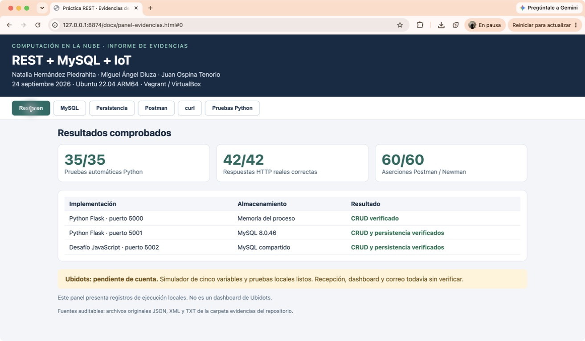
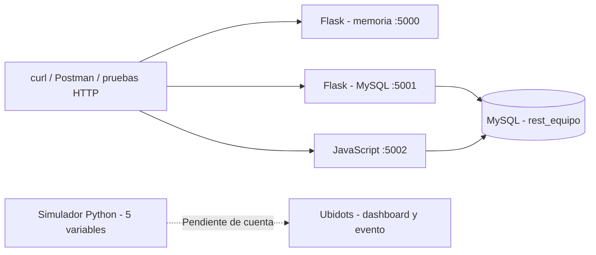

# Práctica REST, MySQL e IoT

**Natalia Hernández Piedrahita · Miguel Ángel Diuza · Juan Ospina Tenorio**
Computación en la Nube · Especialización · 24 de septiembre de 2026

[](https://github.com/nathernandez1189/practica-rest-mysql-ubidots/actions/workflows/pruebas.yml)

Implementación y evidencias de las guías **Práctica REST** y **Práctica REST + MySQL**. Incluye el desafío opcional en JavaScript.

> **Estado de entrega:** APIs y pruebas ejecutadas en Ubuntu. Ubidots está implementado y probado localmente, pero falta una cuenta real para verificar recepción, dashboard y alerta por correo. Esta entrega no afirma que esos requisitos en la nube estén terminados.

## Empezar por aquí

- [Informe de resultados en PDF](docs/Informe-Practica-REST-MySQL-IoT.pdf)
- [Matriz de requisitos y evidencias](docs/MATRIZ_REQUISITOS.md)
- [Cómo reproducir la práctica](docs/REPRODUCIR.md)
- [Guía de sustentación para los tres integrantes](docs/GUIA_SUSTENTACION.md)
- [Completar Ubidots](docs/UBIDOTS.md)
- [Fuentes y adaptaciones del material docente](docs/REFERENCIAS.md)



## Qué contiene

| Componente | Archivo | Almacenamiento | Puerto |
|---|---|---|---:|
| API Flask en memoria | `apirest.py` | Memoria del proceso | 5000 |
| API Flask + MySQL | `apirest_mysql.py` | MySQL 8.0 | 5001 |
| Desafío en JavaScript | `bonus-node/server.js` | La misma base MySQL | 5002 |
| Simulador IoT | `testUbidots.py` | Envío a Ubidots con token local | HTTPS |



## Resultados verificados

Los grupos siguientes contienen comprobaciones complementarias y parcialmente solapadas; no se suman como requisitos independientes.

| Prueba | Resultado | Evidencia |
|---|---:|---|
| Pruebas Python: API, errores y contrato IoT | 35 aprobadas | [pytest.txt](evidencias/pytest.txt) |
| HTTP real: memoria, MySQL y JavaScript | 42 respuestas correctas, 14 por API | [http-real.json](evidencias/http-real.json) |
| Colección Postman ejecutada por Newman | 60 aserciones correctas, 20 por API | [memoria](evidencias/newman-5000.txt), [MySQL](evidencias/newman-5001.txt), [JavaScript](evidencias/newman-5002.txt) |
| curl: CRUD y validaciones | 21 respuestas correctas, 7 por API | [memoria](evidencias/curl-memoria.txt), [MySQL](evidencias/curl-mysql.txt), [JavaScript](evidencias/curl-javascript.txt) |
| Consulta directa MySQL | Tabla, columnas y registros visibles | [mysql-tabla.txt](evidencias/mysql-tabla.txt) |
| Apagado y encendido de Ubuntu | Ver registro antes/después | [persistencia.json](evidencias/persistencia.json) |
| Simulador con cinco variables | Generación y contrato local comprobados | [simulación local](evidencias/ubidots-simulacion-local.txt) |

**Precisión sobre Postman:** se ejecutó la colección con Newman, su ejecutor oficial. No se presentan esos resultados como pruebas mediante la interfaz gráfica de Postman.

**Precisión sobre IoT:** las pruebas de respuestas Ubidots usan dobles de prueba; no contactan el servicio. La generación local tampoco certifica recepción en la nube.

## Uso rápido en el entorno probado

En el Mac:

```bash
cd ~/prueba
vagrant up servidorUbuntu --no-provision
vagrant ssh servidorUbuntu
```

En Ubuntu:

```bash
cd /home/vagrant/practica-rest-equipo
.venv/bin/pytest -v
bash scripts/curl_crud.sh http://127.0.0.1:5001
python3 scripts/verify_http.py
bash scripts/mysql.sh -e 'SHOW TABLES; SELECT * FROM books;'
```

Desde el Mac, `http://192.168.100.3:5001/books` permite consultar MySQL por REST. Las APIs funcionan en la red local del laboratorio; el repositorio público aloja código y evidencias, no el servidor de las APIs.

## Contrato HTTP

| Método y ruta | Acción | Respuesta normal |
|---|---|---|
| `GET /books` | Lista libros | 200 |
| `GET /books/<id>` | Consulta uno | 200 / 404 |
| `POST /books` | Crea un libro con `title` | 201 / 400 |
| `PUT /books/<id>` | Actualiza campos enviados | 200 / 400 / 404 |
| `DELETE /books/<id>` | Elimina el libro | 200 / 404 |
| `GET /health` | Comprueba servicio y almacenamiento | 200 / 503 |

Los campos `title`, `description` y `author` son textos de hasta 255 caracteres. El título no puede quedar vacío. No se aceptan campos adicionales. Los errores MySQL se exponen como 503 sin revelar detalles internos.

## ¿Qué ocurre con los datos al apagar la máquina?

La API en memoria pierde las modificaciones cuando termina su proceso. MySQL conserva las transacciones confirmadas en el disco de la VM y recupera los registros al encender. Esto no protege frente a eliminar la máquina, borrar el disco o corromperlo: se incluye una copia de seguridad de la base de práctica.

## Reproducibilidad y cuidado de datos

- Dependencias principales fijadas y versiones ejecutadas en `evidencias/dependencias.txt`.
- Colecciones Postman y resultados JSON/JUnit para repetir y auditar.
- Pruebas automáticas en GitHub Actions, incluyendo MySQL real como servicio de integración.
- Contraseñas y token solo en configuración local; `.env` y `.venv` están excluidos.
- La base del ejercicio es `rest_equipo`. Los scripts no eliminan bases ni proyectos existentes.
- El `Vagrantfile` incluido crea la alternativa `servidorRest`; las evidencias corresponden a `servidorUbuntu` ya existente. Consulte las [adaptaciones](docs/REFERENCIAS.md).
